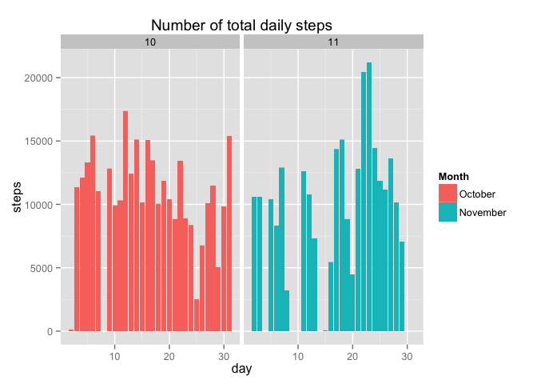
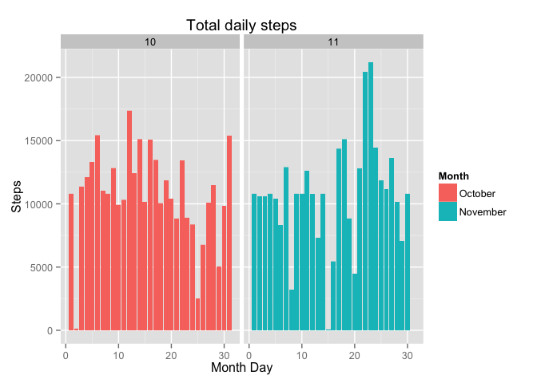

# Reproducible Research: Peer Assessment 1

The data from personal activity monitoring device. The device collects data at 5 minute intervals through the day. The data consist of two months of data from an anonymous individual colected during the months of October and November, 2012 and include the number of steps taken in 5 minute interval each day.

## Loading and preprocessing the data

Unzip the file and inspect it.

```r
unzip(zipfile = "activity.zip")
activity <- read.csv(file = "activity.csv", header = T)
head(activity, 5)
```

```
##   steps       date interval
## 1    NA 2012-10-01        0
## 2    NA 2012-10-01        5
## 3    NA 2012-10-01       10
## 4    NA 2012-10-01       15
## 5    NA 2012-10-01       20
```

```r
tail(activity, 5)
```

```
##       steps       date interval
## 17564    NA 2012-11-30     2335
## 17565    NA 2012-11-30     2340
## 17566    NA 2012-11-30     2345
## 17567    NA 2012-11-30     2350
## 17568    NA 2012-11-30     2355
```

```r
str(activity)
```

```
## 'data.frame':	17568 obs. of  3 variables:
##  $ steps   : int  NA NA NA NA NA NA NA NA NA NA ...
##  $ date    : Factor w/ 61 levels "2012-10-01","2012-10-02",..: 1 1 1 1 1 1 1 1 1 1 ...
##  $ interval: int  0 5 10 15 20 25 30 35 40 45 ...
```


## What is mean total number of steps taken per day?


```r
#prepare data for elaborations
library(lubridate)
library(ggplot2)
#create two variables to identify days and months
activity$day <- day(activity$date)
activity$month <- as.factor(month(activity$date))
activity$monthname <- ifelse(activity$month == 10, "October", "November")
activity$date <- as.Date(activity$date, "%Y-%m-%d")

#find NA in steps, make an index
activ.complete <- complete.cases(activity$steps)
#remove it
act <- activity[activ.complete,]
```


###Make an histogram of the total number of steps taken each day

```r
#plot the total number of steps each days for the two months
ggplot(aes(day, steps), data=act) + geom_histogram(stat = "identity") + facet_wrap(~month) + ggtitle(label = "Number of total daily steps") + scale_fill_discrete(breaks = c("10", "11"), labels = c("October", "November"), guide = guide_legend(title = "Month"))
```

 

###Calculate and report the mean and median total number of steps taken per day

```r
steps.day <- aggregate(steps~day, act, sum)
daily.mean.steps <- mean(steps.day$steps)
daily.median.steps <- median(steps.day$steps)
```

The mean of total number of steps each day is 1.9020267\times 10^{4} and the median is 2.05975\times 10^{4}.


## What is the average daily activity pattern?

###Make a time series plot (i.e. type = "1") of the 5-minute interval (x-axis) and the average number of steps taken, averaged across all days (y-axis)

```r
ggplot(aes(interval, steps, fill = month), data = act) + geom_bar(stat = "identity") + facet_grid(day~month)+ ggtitle(label = "Average Activity Pattern") + labs(x = "Interval", y = "Steps") + scale_fill_discrete(breaks = c("10", "11"), labels = c("October","November"), guide = guide_legend(title = "Month"))
```


###Which 5-minute interval, on average across all the days in the dataset, contains the maximum number of steps?

```r
maxsteps <- which(act$steps == max(act$steps))
max.steps <- act[maxsteps,]
```
The maximum number of steps across each days is at the 5-minute interval n. 615 occurred on November the 27th, with 806 steps.


## Imputing missing values

There are a number of days/intervals ehere there are some missing values (NAs). The presence of missing days may introduce bias into some calculations or summaries of the data.


###Calculate and report the total number of missing values in the dataset

```r
#calculate the number of missing values
#display in a table
table(is.na(activity))
```

```
## 
##  FALSE   TRUE 
## 103104   2304
```

```r
#same in a vector
numNA <- sum(is.na(activity))
```

In the dataset there are 2304 missing values.


###Devise a strategy for filling in all the missing values in the dataset (...).

```r
avg.steps <- aggregate(steps ~ interval, data = act, FUN = mean)
head(avg.steps)
```

```
##   interval     steps
## 1        0 1.7169811
## 2        5 0.3396226
## 3       10 0.1320755
## 4       15 0.1509434
## 5       20 0.0754717
## 6       25 2.0943396
```

To replace the NAs values, I've calculated the mean for that 5-minute interval. After that I use a `for - loop` to fill the NAs with those values.

###Create a new dataset that is equal to the original dataset but with the missing data filled in.

```r
#create a new dataframe that is the initial copy of the original
act.new <- activity
#use a for loop to find NAs and replace them with the 5-minute interval mean and modify the new dataset
for (i in 1:nrow(act.new)) {
  if (is.na(act.new[i,1])){
    x <- subset(avg.steps, act.new[i,3] == avg.steps$interval)
    act.new[i,1] <- x[1,2]
  }
}
```

The new dataframe contains now the replaced values; there are no more NAs.


```r
head(act.new)
```

```
##       steps       date interval day month monthname
## 1 1.7169811 2012-10-01        0   1    10   October
## 2 0.3396226 2012-10-01        5   1    10   October
## 3 0.1320755 2012-10-01       10   1    10   October
## 4 0.1509434 2012-10-01       15   1    10   October
## 5 0.0754717 2012-10-01       20   1    10   October
## 6 2.0943396 2012-10-01       25   1    10   October
```

```r
tail(act.new)
```

```
##           steps       date interval day month monthname
## 17563 2.6037736 2012-11-30     2330  30    11  November
## 17564 4.6981132 2012-11-30     2335  30    11  November
## 17565 3.3018868 2012-11-30     2340  30    11  November
## 17566 0.6415094 2012-11-30     2345  30    11  November
## 17567 0.2264151 2012-11-30     2350  30    11  November
## 17568 1.0754717 2012-11-30     2355  30    11  November
```

```r
table(is.na(act.new))
```

```
## 
##  FALSE 
## 105408
```


###Make a histogram of the total number of steps taken each day and Calculate and report the mean and median total number of steps taken per day. Do these values differ from the estimates from the first part of the assignment? What is the impact of imputing missing data on the estimates of the total daily number of steps?


```r
#plot the total number of steps each days for the two months
ggplot(aes(day, steps, fill = month), data=act.new) + geom_histogram(stat = "identity") + facet_grid(~month, labeller = ) + ggtitle(label = "Total daily steps") + labs(x="Month Day", y = "Steps") + scale_fill_discrete(breaks = c("10", "11"), labels = c("October","November"), guide = guide_legend(title = "Month"))
```

 


```r
summary(act.new)
```

```
##      steps             date               interval           day       
##  Min.   :  0.00   Min.   :2012-10-01   Min.   :   0.0   Min.   : 1.00  
##  1st Qu.:  0.00   1st Qu.:2012-10-16   1st Qu.: 588.8   1st Qu.: 8.00  
##  Median :  0.00   Median :2012-10-31   Median :1177.5   Median :16.00  
##  Mean   : 37.38   Mean   :2012-10-31   Mean   :1177.5   Mean   :15.75  
##  3rd Qu.: 27.00   3rd Qu.:2012-11-15   3rd Qu.:1766.2   3rd Qu.:23.00  
##  Max.   :806.00   Max.   :2012-11-30   Max.   :2355.0   Max.   :31.00  
##  month      monthname        
##  10:8928   Length:17568      
##  11:8640   Class :character  
##            Mode  :character  
##                              
##                              
## 
```

```r
steps.day.new <- aggregate(steps~day, act.new, sum)
daily.steps.mean.new <- mean(steps.day.new$steps)
daily.steps.median.new <- median(steps.day.new$steps)
```

The mean of total number of steps each day is 2.11851\times 10^{4} and the median is 2.1641\times 10^{4}. 

Replacing the NAs with the calculated value increased the `mean` and `median` value of the sampled data.


## Are there differences in activity patterns between weekdays and weekends?

For this part the `weekdays()` function may be of some help here. Use the dataset with the filled-in missing values for this part.

###Create a new factor variable in the dataset with two levels - "weekday" and "weekend" indicating whether a given date is a weekday or weekend day.

Using the `ifelse()` function along with `weekdays()` it is possible to compute `weekend` and `weekdays`


```r
#compute the weeksdays
act.new$weekdays <- weekdays(act.new$date)
#compute the dicotomic variable "Weekdays", "Weekend"
act.new$weekd <- ifelse(act.new$weekdays == "Saturday" | act.new$weekdays == "Sunday", "weekend", "weekday")
```

###Make a panel plot containing a time series plot (i.e. type = "1") of the 5-minute interval (x-axis) and the average number of steps taken, average across all weekday days or weekend days (y-axis).

```r
ggplot(aes(interval, steps), data = act.new) + geom_bar(stat = "identity") + facet_grid(~weekd) + ggtitle("Average Steps at 5-minute Interval")
```


